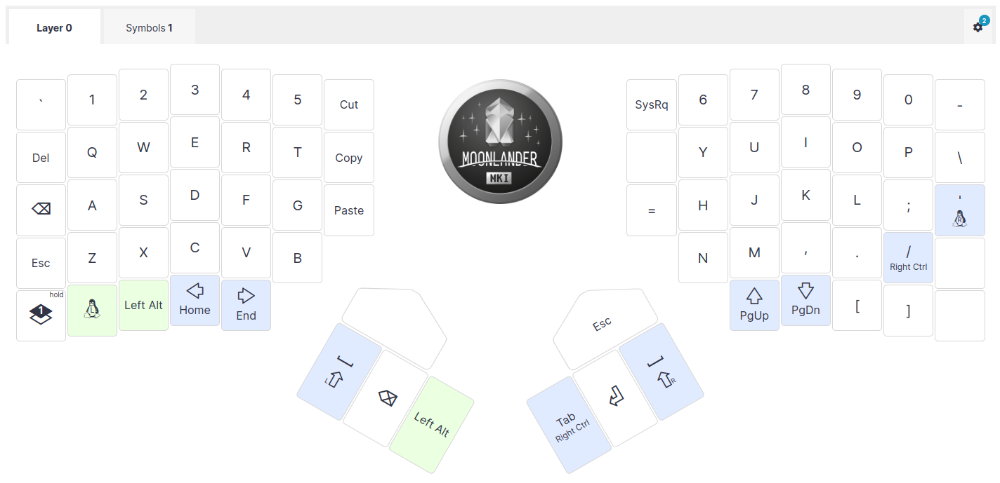

# moonlander-qmk-layout

QMK layout/source for my ZSA Moonlander keyboard

So far I've been using ZSA's cloud-based [Oryx](https://www.zsa.io/oryx/) configuration tool, just because it's so easy - GUI keyboard layouts right in your browser, and flash the firmware to the keyboard right from a browser. So far, this repo is just a backup of the Oryx-generated sources.

The source from Oryx's "Download Source" link is in [source/](source/), with the `.bin` and `.md5` filenames changed to be version-independent. This directory also includes the the compiled firmware binary.

**Firmware Version:** v22.0

Key Types:

Original layout PDF: [layout.pdf](layout.pdf)
